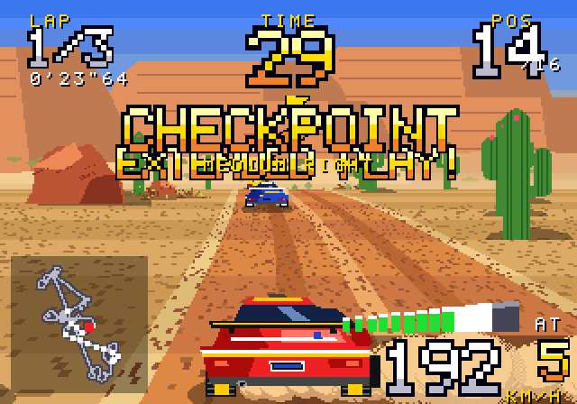
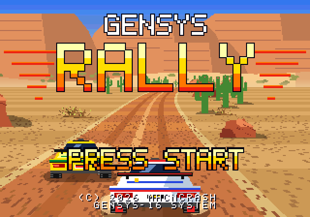
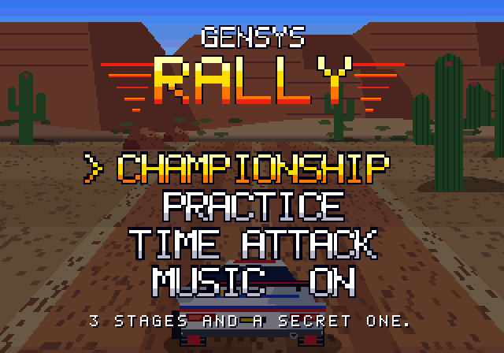
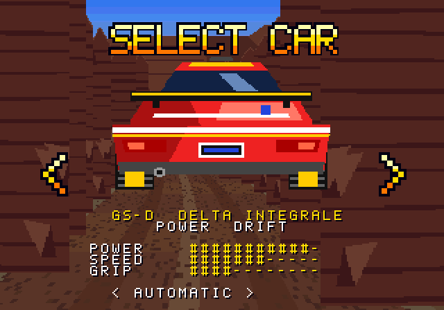
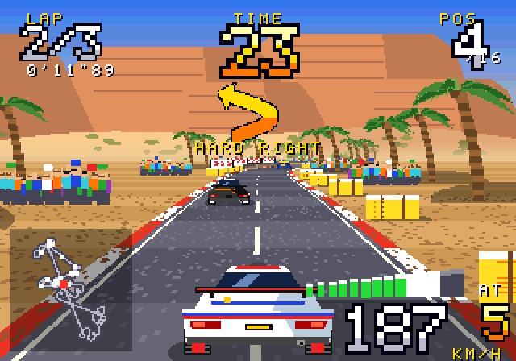
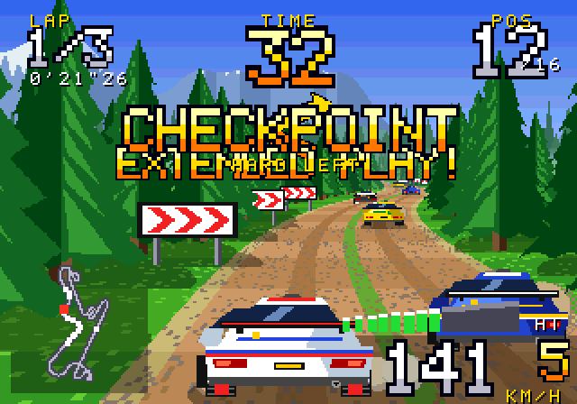
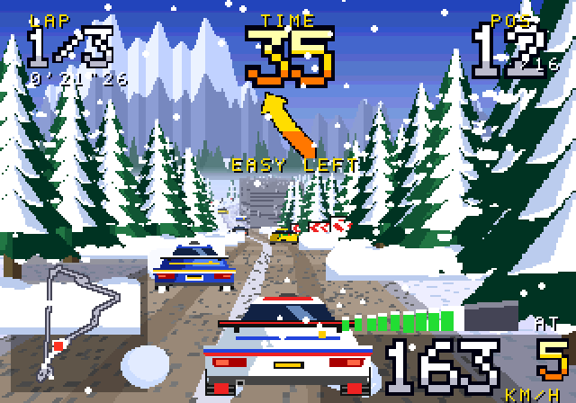
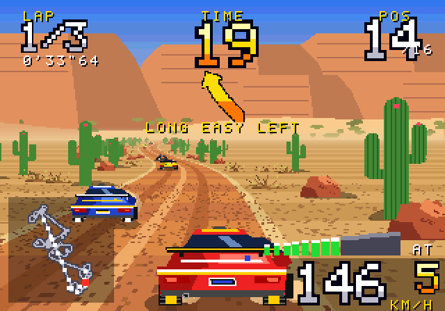
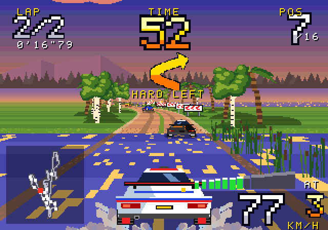

<div align="center">

# S3 RALLY

**A 16-bit arcade rally racer, running on a console that never existed.**




▶ **[Watch the full run with sound](docs/gameplay.mp4)**: boot, menus, car select, and a Desert stage from 16th on the grid.

</div>

---

S3 RALLY is a four-stage championship in the style of mid-90s arcade
rallying. You power-slide gravel bends, splash through fords, listen to your
co-driver's pace notes, and chase checkpoints before the clock runs out.

It runs on the **S3-16**, a 16-bit console written from scratch in C++. The
console is a Genesis-style tile-and-sprite machine plus the two custom chips
that made the 80s "super scaler" arcade boards special: a **hardware sprite
scaler** and a **road generator**. Every graphic, song and sound effect is
generated at boot. There are no asset files.

## Features

- **4 stages:** Desert canyon, Forest pass, Alpine summit in falling snow, and
  a Lakeside sunset special stage that you have to earn.
- **3 modes:** Championship (your finishing position becomes your grid slot for
  the next stage), Practice, and Time Attack with saved records.
- **15 AI rivals** that brake for corners, pick lines, and block.
- **Surfaces change the handling:** tarmac, dirt, sand, snow and water fords all
  drive differently.
- **2 cars,** each with automatic or manual transmission.
- **A co-driver** calls every corner: *"medium left"*, *"hairpin right, don't
  cut!"*, *"over crest!"*.
- **A 4-operator FM soundtrack** with five original songs, PCM drums, an engine
  that follows the revs, and rival engines that pass with Doppler.
- **An arcade finish:** CRT scanlines, 4:3 output, a live course map and a rev
  counter. The clock-out comes with a *"Game over. Yeah!"*

<p align="center">
    <br>
    <br>
   
</p>

## Build and play

```bash
# macOS
brew install sdl2
# Debian / Ubuntu
sudo apt install libsdl2-dev

make
./s3
```

| | Keyboard | Gamepad |
|---|---|---|
| Steer | ← → | stick / D-pad |
| Accelerate | C / Space / ↑ | right trigger · A |
| Brake | X / ↓ | left trigger · B |
| Shift down / up (manual) | Q / W | LB / RB |
| Start · pause · select | Enter | Start |
| Back · quit (while paused) | Esc | Back |
| Music | E | Y |
| CRT scanlines · fullscreen · screenshot | F1 · F11 · F12 | |

**Tip:** at speed, hold the steering *into* a bend. The tail steps out and the
car carries speed through corners that would otherwise push you onto the grass.

The co-driver's voice is generated on first run with the macOS `say` command.
On other systems the game runs without speech.

## The S3-16

| | |
|---|---|
| Video | 320×224 at 60 Hz · 4096 colours · 16 palettes · 8192 tiles · 2 scrolling planes and a HUD layer |
| Sprites | 256 per frame, each scaled to any size, with fog, shadow mode and clip line |
| Road generator | textured road from per-scanline registers: surface, verges, water, kerbs, bands |
| Raster | per-line scroll, backdrop colour and distance fog |
| Audio | 6-channel 4-operator FM · 3 square + noise PSG · 2 PCM channels |
| Input | 6-button pad plus analog stick and triggers |

Full reference: **[docs/HARDWARE.md](docs/HARDWARE.md)**.

```
src/console/   vdp · apu · system (SDL2 board, boot ROM) · gfx (SDK, font ROM)
src/game/      rally (game, physics, AI, HUD) · stages · art · sound
```

## Headless test

```bash
./s3 --sim                  # autopilot races every stage and reports
./s3 --sim --shots DIR      # plus PNG screenshots
./s3 --record V.raw A.raw   # scripted player, raw video + audio for ffmpeg
```

## License

MIT © macncrash
